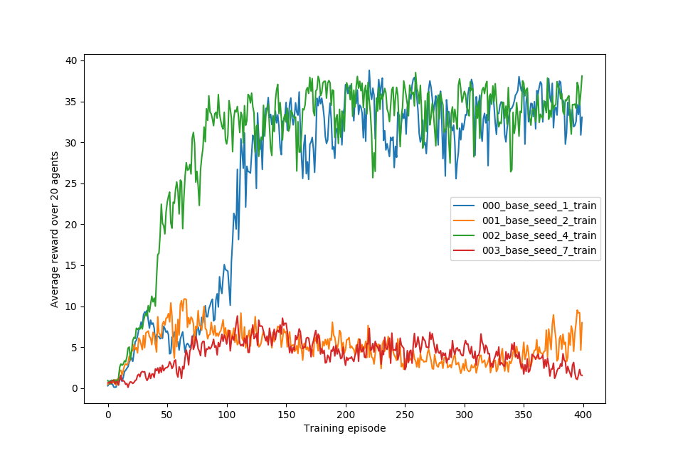
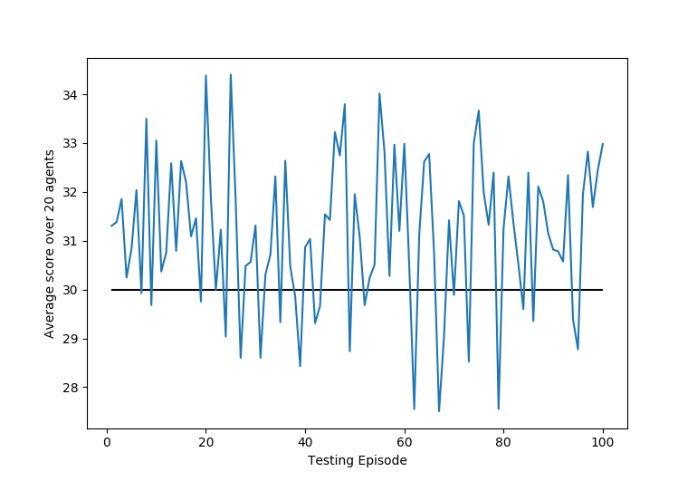

# Report
The scope of this report is to describe the learning algorithm, the hyperparameters and the performance of the agent used to solve the reacher v2 environment.

# Learning algorithm and hyper parameters
The agent uses the [DDPG algorithm.](https://arxiv.org/abs/1509.02971) DDPG is an actor-critic method: The optimal policy is directly estimated by an actor network from the input state. During training however, a second critic  network is used which estimates the value/advantage of a certain action in a given state to adjust the stepwidth of the gradient.
The hyper parameters of the algorithm were optimised in an informal search process. The parameters proposed in the [ddpg-pendulum notebook](https://github.com/udacity/deep-reinforcement-learning/tree/master/ddpg-pendulum) served as a baseline. Unfortunately, training of the DDPG algorithm depends strongly on the initial random seed as illustrated in the following figure. The four different training runs only differ by the initial random seed:

It was found that performance of the baseline model could also be achieved with smaller actor and critic networks containing two hidden layers with 200 and 150 units.

# Performance of the agent
In a test run consisting of 100 episodes, the agent(s) achieved an average score of *31.13* (with a standard deviation of *5.8* over all agents and episodes) thus succesfully achieving the required performance. The following plots show the average reward over all 20 agents per test episode:

# Outlook
Future work should make the DDPGAgent more stable and less prone to different initial conditions. The use of a noisy policy network instead of action noise could be worth trying. In addition, batch normalization could be used.
As an alternative, other algorithms like PPO and A3C could be used to solve this environement.
